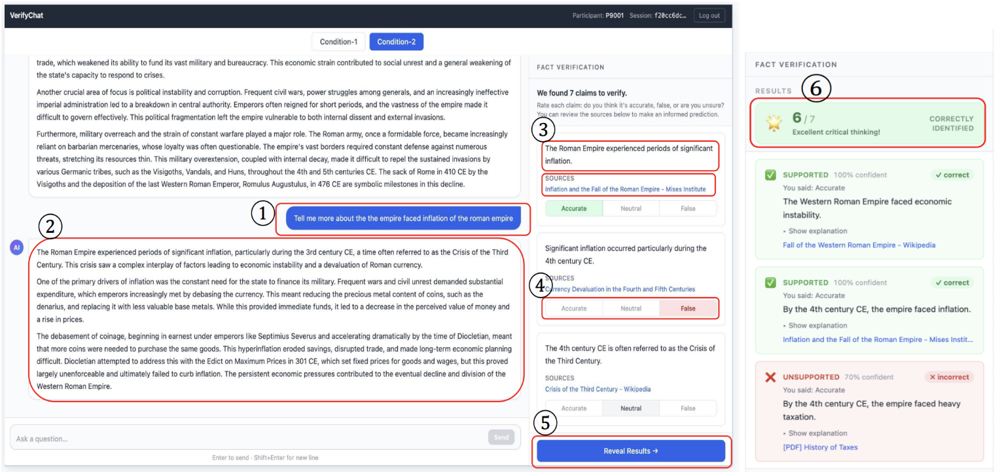
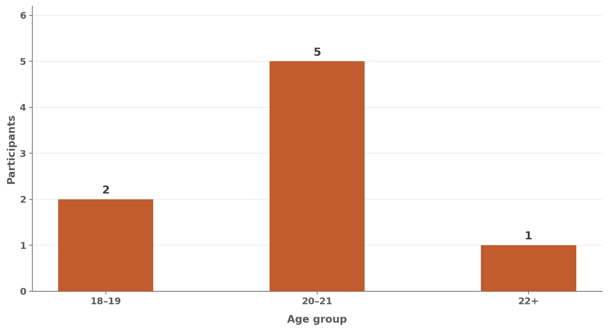
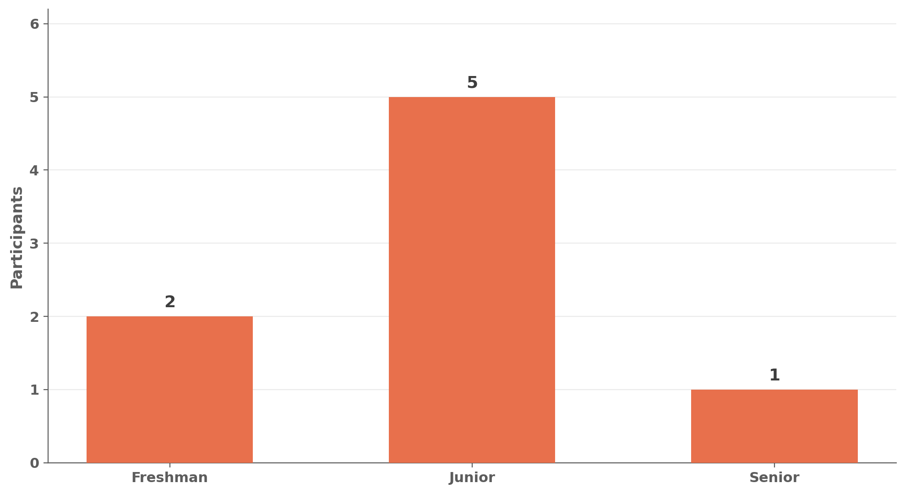
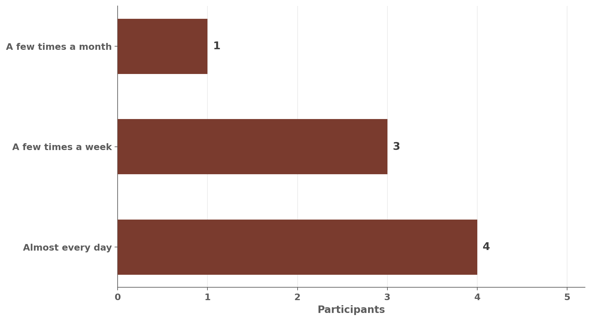
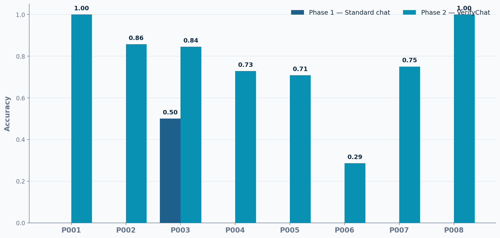
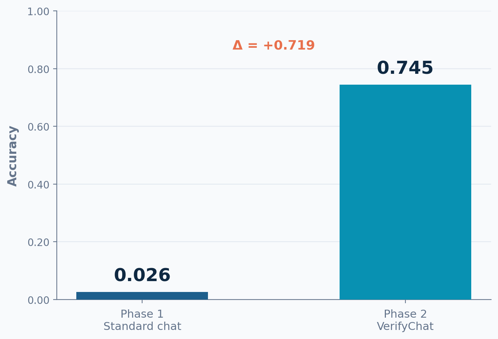
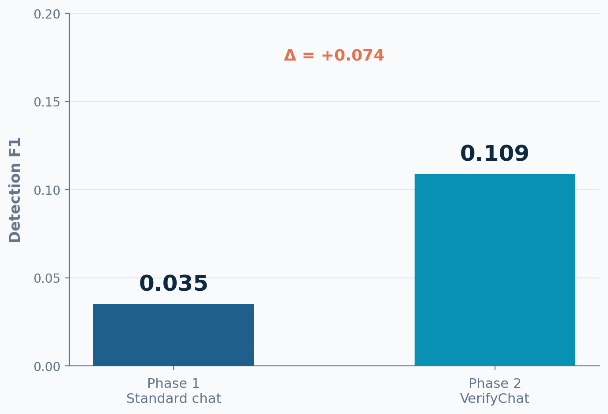
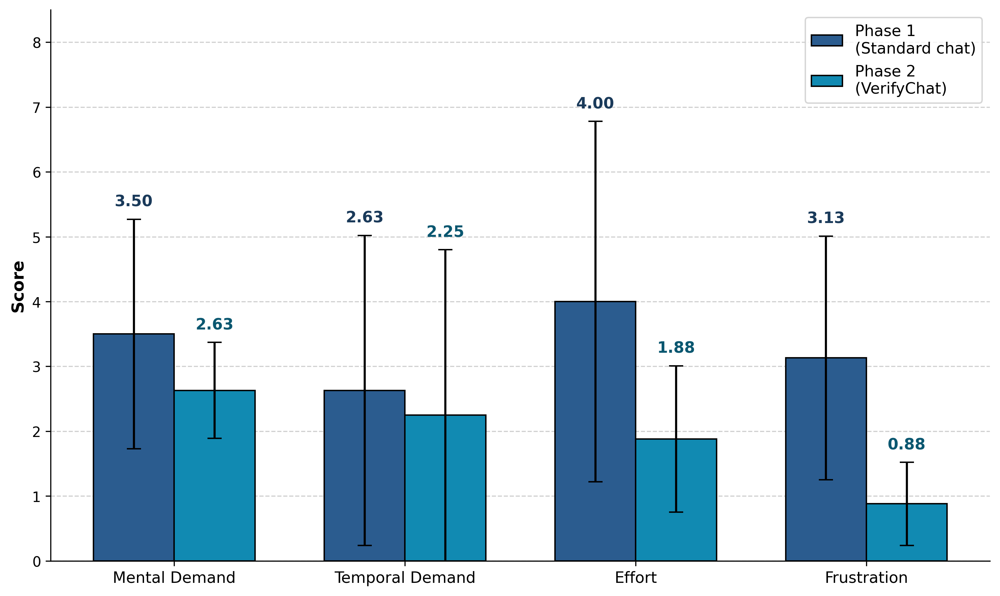
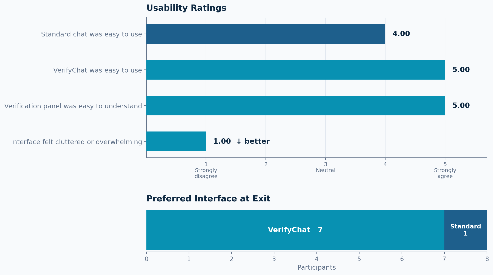

# VerifyChat

**A Chat-Integrated Fact-Checking System for Developing Student Verification Mental Models**

---

Students are increasingly relying on AI chatbots for academic tasks yet they lack systematic strategies for detecting factual errors. Existing verification tools either automate fact-checking completely or require leaving the chat interface entirely — both suppress genuine engagement. VerifyChat embeds claim-level verification directly in the chat workflow through a **predict-then-reveal** interaction pattern: students commit to a judgment about which claims are inaccurate _before_ automated verdicts are shown. This cognitive forcing function is grounded in Buçinca et al.'s work showing that requiring deliberation before seeing AI recommendations significantly reduces overreliance.

We conducted a within-subjects study (N = 10) with undergraduate students across two conditions: standard chat baseline → VerifyChat.

📄 [Project Report](<VerifyChat- A Chat-Integrated Fact-Checking System for Developing Student Verification Mental Models.pdf>)   🎥 [Demo](figures/verifyChat_demo.mp4)

---

## System



The interface has two parallel panels. The left chat panel displays AI responses as clean text with no inline markers. The right verification panel runs the predict-then-reveal cycle: claims are extracted automatically, students predict which are inaccurate, then click "Reveal Results" to see verdicts alongside web-retrieved evidence snippets.

The verification pipeline runs five stages — claim decomposition, checkworthiness filtering, query generation, evidence retrieval (Serper API), and verdict assessment (Gemini) — all triggered automatically after each AI response.

---

## Results

### Participants



All participants were aged 18–22 (M = 20.13, SD = 1.25), undergraduate students who self-reported using AI chatbots for academic tasks at least a few times per month.




### Hallucination Detection



Mean accuracy improved from **2.6%** in Phase 1 (standard chat) to **74.5%** in Phase 2 (VerifyChat) — an absolute gain of ~72 percentage points. Every participant exhibited higher accuracy in Phase 2 than in Phase 1.



Mean detection F1 improved from **0.035 → 0.109**. Statistical tests confirmed a highly significant difference: paired t(7) = 7.47, p < .001; Wilcoxon W = 0.0, p = .008; effect size Cohen's d = 2.64.



### Cognitive Load (NASA-TLX)



Overall NASA-TLX ratings dropped across all four dimensions from Phase 1 to Phase 2. The largest reductions were on **Frustration** (3.13 → 0.88) and **Effort** (4.00 → 1.88). Two participants who entered without a source-checking habit reported _higher_ effort with VerifyChat — consistent with the per-claim step feeling like additional work rather than a substitute strategy.

### Usability and Preference



VerifyChat received a mean usability rating of 5.00/5 for ease of use. The verification panel was uniformly rated as easy to understand (M = 5.00). **7 of 8 participants preferred VerifyChat** over the standard chat at exit.

---

## Key Finding: False Security

One participant (P001) marked all 19 claims as "Accurate" in Phase 2, never engaged with the verification step, yet rated VerifyChat 5/5 for usability and selected it as their preferred interface. This directly replicates the "false security" effect documented for automated verification tools — positive usability ratings without genuine behavioral change are not equivalent to AI literacy.

---

## Demo

<video src="figures/verifyChat_demo.mov" controls width="100%"></video>

---

## Stack

- **Backend**: FastAPI / Python 3.11+ / aiosqlite
- **Frontend**: React
- **LLM**: Google Gemini (`gemini-2.5-flash`)
- **Search**: Serper API

```bash
uvicorn backend.main:app --reload --port 8000
cd frontend && npm run dev   # port 5173
```

Set `GEMINI_API_KEY` and `SERPER_API_KEY` in `.env`.

---
